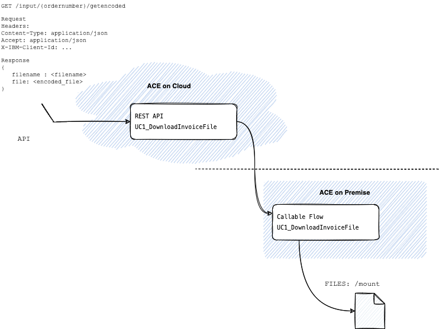
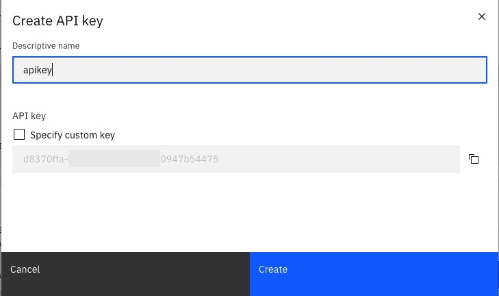
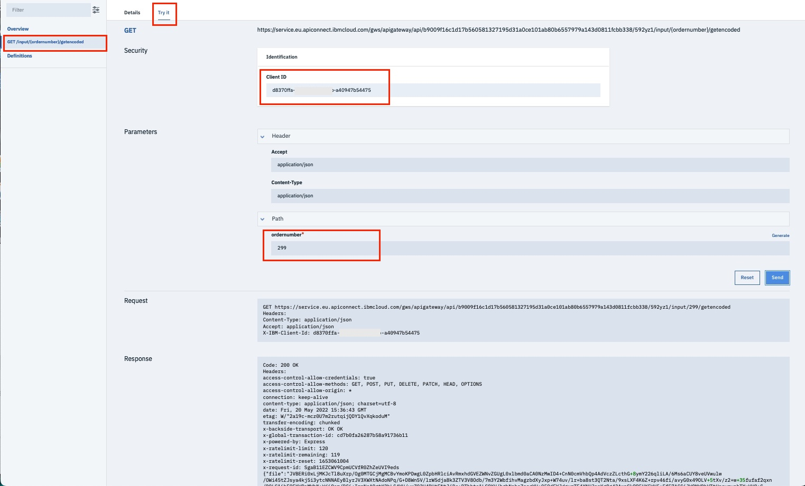

# Expose on-premises files with App Connect on Cloud on Hybrid architecture 


The goal is to provide an API exposed by ACE on Cloud to download a file (In this case a PDF file) provided by ACE on Premise.

This API will be used by a consumer app (Magento for example) to retrieve the invoice document.

So, we give an order number in the request and the corresponding invoice PDF file is returned.




The sequence is the following :


The API is provided by ACE on Cloud "API Flow" and retrieve file from On-premise using Callable-flow. 

## No-Functional Requirement
- The API will be made available with App Connect on IBM Cloud (Saas offering)
- Files are available on-premises and will be served through an existing App Connect Enterprise instance (Native install on Windows Server)
- Communication between the 2 instances (Cloud and on-premises) will be done with Callable flows


> The advantage of Callable flow is to have a secure connection between SaaS and On-Premises with mTLS communication.

## Logical Architecture


## Flows specifications


- Flow 1: [UC1_DownloadInvoiceFile.yaml](./designer/UC1_DownloadInvoiceFile.yaml)

	- It is the "Flow for API" to deploy in *ACE on Cloud*.
    - This flow exposes an API and use Callable Flow to request on-premises AppConnect Enterprise.
    - The Callable flow invoke return is parsed to update *Response* body
	
	
	
	
- Flow 2: [UC1_CallableFileRead](./toolkit/src/CallableFileRead.zip)

	- It is the flow to deploy on the  *ACE on premise*
    - This flow search and return file for the specified order number.
    - *odernumber* is available in LocalEnvironment.Variables and used to generated file name pattern (IN_*<ordername>*.pdf). This pattern will be used to seach file in the local directory.
    - The file is then returned **encoded** or as **Blob** format (depending on  the type of request. See alternative solution in this tutorial)
	
	


## Prepare your environment


1. **Donwload ACE Toolkit** and Install Toolkit
    - [Download IBM App Connect Enterprise for Developers and get started with a hands-on experience](https://www.ibm.com/docs/en/app-connect/12.0?topic=enterprise-download-ace-developer-edition-get-started)
2. **Configure a local Integration Server**.
    - in the Integration Explorer pane of the toolkit, right-click Integration servers, and then click **Create a local integration server**; enter a name for the integration server, default is  TEST_SERVER, optionally change the options, and then click **Finish**.
3. If you don't have it, **create an App Connect instance on IBM Cloud**
    - Go to App Connect offering https://cloud.ibm.com/catalog/services/app-connect and choose **Lite** plan and click **Create**
4. **Configure Callable flow connection**

    - Sign in to **IBM App Connect on IBM Cloud**.
    - On the Dashboard, click the **Callable flows** icon 
    - Click **Connect callable flows**.

    *Figure 2. App Connect Dashboard, showing the Callable flows features*
    

    - This opens the **Synchronize your on-premises agent dialog**.

    *Figure 3. The Synchronize your on-premises agent dialog*
    

    - Click **Download the configuration**; this opens a dialog to **save the agentx.json** file.

    - Leave the Synchronize your on-premises agent dialog open (note the dialog contains instructions for installing the agent into the work directory of the integration server in App Connect Enterprise)
    - After saving the agentx.json file, **copy the file to the work directory of the integration server in App Connect Enterprise Tookit**: (For example) `workdirectory/TEST_SERVER/config/iibswitch/agentx`

    - **In your "on-premises" ACE toolkit, if the integration server is not running, start it**; for example, in the toolkit right-click the server and then click Start

    - **Check the console log** (To view in the toolkit, you might need to Refresh the server entry under Independent Resources.) You should see messages that indicate ...The integration server component 'agentx' has been started; for example:
    ```
    component starting: "agentx"
    Starting agentx with config folder: 'C:\Users\IANLarner\IBM\ACET11\workspace\myServer\config\iibswitch\agentx'
    2020-06-29 13:31:51.082740: The connection agent for remote callable flows has established a connection to the Switch server with URL 'wss://ibm-sw-aaaahbbbcccciqiz.eu-gb.ace.ibm.com:443/'. 
    2020-06-29 13:31:51.088324: The integration server component 'agentx' has been started. 
    component started: "agentx"
    ```
    - **Switch back to the App Connect Designer** window and then test the agent connection:
        - Click **Test your agent**

            You should see at least 1 agent found. Secure communications for callable flows has been established between IBM App Connect on IBM Cloud and the integration server in your local IBM App Connect Enterprise toolkit.
        
        - You can now close the Synchronize your on-premises agent dialog.

    


    You have established secure connectivity between flows running in App Connect on IBM Cloud and in the integration server in your on-premises App Connect Enterprise.

## Import and deploy flow components

1. **Import the enterprise integration project into the toolkit** in the Toolkit
    - Download the project interchange file by clicking the link above and saving the file to your local machine.
      Download file : [CallableFileRead.zip](https://github.com/fdut/file-download-callableflow/raw/main/toolkit/src/CallableFileRead.zip)
    - Open the toolkit.
    - Import the project into the toolkit. For example, **click File > Import, select IBM Integration > Project Interchange, select the downloaded file, then click Finish**.
6. Update File directory parameter .
    - In toolkit. Extend Application **UC1_CallableFileRead** and open flow **ReturnFileAsMultiPart.msgflow**
    - Click on node **File Read** 
    - Update path of the **input directory** where are located PDF files.
            
    - **Copy the sample PDF file in the input directory**

        - [Download Sample PDF files](https://github.com/fdut/file-download-callableflow/tree/main/samples)

8. Deploy the Application to the integration server in the toolkit you intend to use for the tutorial (TEST_SERVER); for example, drag the Application named **UC1_CallableFileRead** and then drop it onto the integration server *TEST_SERVER*.  

    
7. In App Connect on IBM Cloud, configure and start the callable flow
    - Download flow [UC1_DownloadInvoiceFile.yaml](https://raw.githubusercontent.com/fdut/file-download-callableflow/main/designer/UC1_DownloadInvoiceFile.yaml)
    - To import the flow, from the dashboard select New > Import flow..., copy or select the flow definition file, then click Finish. This imports the flow and opens it in the Flow editor.

8. After importing the flow, click the action nodes to check the configuration (Callableflow)
9. To exit and start the flow, open the options menu **[⋮]** in the banner and **click Start API**; then click **Dashboard**.

Otherwise, just return to the Dashboard, You can start the flow from there, as outlined in the Test the flow step.

## Test the flow

- Go to your App Connect on Cloud
- In the API Flow click on **Manage**
    
- Go bottom and in the *Sharing outside of Cloud Foundry organization* click on button *Create API key and documentation link*
    
- Click on button *Create API key and documentation createapikey.jpg
    

- Copy the API document link
    
- Open it in your browser on test your API with your API Key.
- Click on Get operation.
- Click **try it**
- Enter API Key
- Enter a order number. For example 2999 because my PDF file is IN_00**2999**_22007894_93135.pdf

    

- If all is OK. API Get return 200 with encoded file in body

        ``` 
        { 
          "file": "....encoded file ....",
          "filename": "IN_00999_22007894_93135.pdf"
         }
         ```

## Use a Web Front UI

A sample of ReactJS application is provided to demonstrate the API capability.

- Update the following part in App.js with your entries.

```
 // API with encoded result
  const encodedAPIEnpoint =
    'https://service.eu.apiconnect.ibmcloud.com/gws/apigateway/api/b9009f16c1d17b560581327195d31a0ce101ab80b6557979a143d0811fcbb338/SsHJwI'
  const clientId = '<YOUR API KEY>'
  // ------------------------------------------------------------
  ```

  - in the **uc1-front-ui** run **npm install** and **npm start**

  - Enter a order number (Order number will present in PDF file name)
  - Click on button **Get Invoice file (Encoded)** 

 


## Alternative solution

It is also possible to return File with blob format instead encoded in a JSON file.

In ACE on Cloud, you can deploy BAR file. The BAR is a flow you have created in ACE Toolkit.

ACE Toolkit flow give more flexibilities to create REST API and data returned by API.

In case you want to return file as blob, i provided a sample of REST API.

This flow is similar as the REST API provided by *Designer* except the API Response return File as Blob.


 


- Download the [project interchange ZIP file](https://github.com/fdut/file-download-callableflow/blob/main/toolkit/src/APIRequestFileCallable.zip) and extract the BAR file from that archive.


 - In App Connect on IBM Cloud, import the flow:  from the dashboard select **New** > **Import a BAR file** ..., select the **APIRequestFileCallable.bar** file, then click **Import**. 

- Start the flow  and test it. 
    - Click on UC1_APIRequestFileCallable flow
    - Copy/Paste UserName and Password
    - Click on **Show API Explorer**
    - Click on **GET /Invoice** operation
    - Click **Try it**
    - Enter UserName and Password (Copied before)
    - Enter a *ordername* (Order number will present in PDF file name)
    - The file is returned as Blob.


     


# Ressources

- [AppConnect on IBM Cloud](https://cloud.ibm.com/catalog/services/app-connect)
- [Download IBM App Connect Enterprise for Developers](https://www.ibm.com/docs/en/app-connect/12.0?topic=enterprise-download-ace-developer-edition-get-started)
