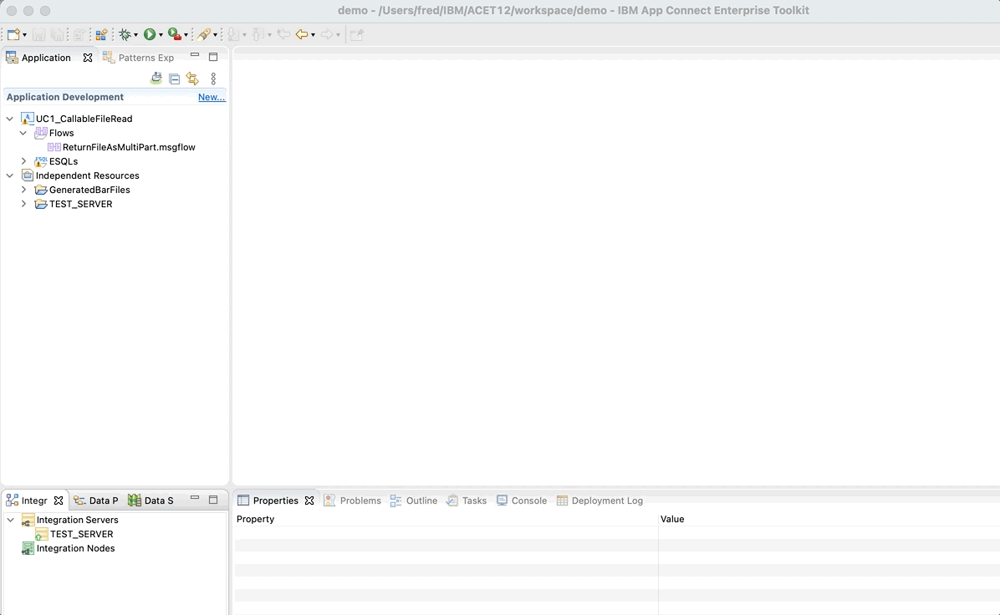

# file-download-callableflow
Expose File on Hybrid architecture with App Connect Enterprise. 


In this blog i want to share with you an use case we implemented for a customer.

The goal was to provide an API to download File (In this case a invoice PDF file) using ACE on Cloud to expose API and ACE on Premise to find and return file.

The sequence is the following :


The API is provided by ACE on Cloud "API Flow" and retrieve file from On-premise using Callable-flow. 

### No-Functional Requirement
- The API will be made available with App Connect on IBM Cloud (Saas offering)
- Files are available on-premise and will be served through an existing App Connect Enterprise instance (Native install on Windows Server)
- Communication between the 2 instances (Cloud and on-premise) will be done with Callable flows

> The advantage of Callableflow is to a have secure connection between SaaS and On-Premise with mTLS communcation.


### Flows specifications


- Flow 1: [UC1_DownloadInvoiceFile.yaml](./designer/UC1_DownloadInvoiceFile.yaml)

	- It is the "Flow for API" to deploy in *ACE on Cloud*.
    - This flow expose an API and use CallableFlow to request On-Premise AppConnect Enterprise
	
	
	
	
- Flow 2: [UC1_CallableFileRead](./toolkit/v11/src/UC1_CallableFileRead)

	- It is the flow to deploy on the  *ACE on premise*
    - This flow search and return file for the specified order number.
	
	


### Déploiement des flux

- Aprés validation, démarrer le flux Ace on Cloud
- Déployer les fichiers BARs sur le serveur ACE on-Premise (UC1_CallableFileRead) et sur ACE on Cloud (UC1_APIRequestFileCallable)


## Test on your environment

To test this use case you need :

1. **Donwload ACE Toolkit** and Install Toolkit
    - [Download IBM App Connect Enterprise for Developers and get started with a hands-on experience](https://www.ibm.com/docs/en/app-connect/12.0?topic=enterprise-download-ace-developer-edition-get-started)
2. **Configure a local Integration Server**.
    - in the Integration Explorer pane of the toolkit, right-click Integration servers, and then click **Create a local integration server**; enter a name for the integration server, default is  TEST_SERVER, optionally change the options, and then click **Finish**.
3. If you don't have it, **create an App Connect instance on IBM Cloud**
    - Go to App Connect offering https://cloud.ibm.com/catalog/services/app-connect and choose **Lite** plan and click **Create**
4. **Configure Callable flow connection**

    - Sign in to IBM App Connect on IBM Cloud.
    - On the Dashboard, click the Callable flows icon Callable flows icon
    - Click Connect callable flows.
    *Figure 2. App Connect Dashboard, showing the Callable flows features*
    
    
    

    - This opens the Synchronize your on-premises agent dialog.
    *Figure 3. The Synchronize your on-premises agent dialog*
    

    - Click Download the configuration; this opens a dialog to save the agentx.json file.

    - Leave the Synchronize your on-premises agent dialog open (note the dialog contains instructions for installing the agent into the work directory of the integration server in App Connect Enterprise).
    - After saving the agentx.json file, copy the file to the work directory of the integration server in App Connect Enterprise Tookit: workdirectory/TEST_SERVER/config/iibswitch/agentx

    - In your "on-premises" ACE toolkit, if the integration server is not running, start it; for example, in the toolkit right-click the server and then click Start

    - Check the console log (To view in the toolkit, you might need to Refresh the server entry under Independent Resources.) You should see messages that indicate ...The integration server component 'agentx' has been started; for example:
    ```
    component starting: "agentx"
    Starting agentx with config folder: 'C:\Users\IANLarner\IBM\ACET11\workspace\myServer\config\iibswitch\agentx'
    2020-06-29 13:31:51.082740: The connection agent for remote callable flows has established a connection to the Switch server with URL 'wss://ibm-sw-aaaahbbbcccciqiz.eu-gb.ace.ibm.com:443/'. 
    2020-06-29 13:31:51.088324: The integration server component 'agentx' has been started. 
    component started: "agentx"
    ```
    - Switch back to the App Connect Designer window and then test the agent connection:
        - Click **Test your agent**

            You should see at least 1 agent found. Secure communications for callable flows has been established between IBM App Connect on IBM Cloud and the integration server in your local IBM App Connect Enterprise toolkit.
        
        - You can now close the Synchronize your on-premises agent dialog.

    
    
    You have established secure connectivity between flows running in App Connect on IBM Cloud and in the integration server in your on-premises App Connect Enterprise.

5. **Import the enterprise integration project into the toolkit** in the Toolkit
    1. Download the project interchange file by clicking the link above and saving the file to your local machine.
      Download file : [CallableFileRead.zip](https://github.com/fdut/file-download-callableflow/raw/main/toolkit/src/CallableFileRead.zip)
    2. Open the toolkit.
    3. Import the project into the toolkit. For example, **click File > Import, select IBM Integration > Project Interchange, select the downloaded file, then click Finish**.
6. Update File directory.
    - In toolkit. Extend Application **UC1_CallableFileRead** and open flow **ReturnFileAsMultiPart.msgflow**
    - Click on node **File Read** 
    - Update path of the **input directory** where are located PDF files.

        
8. Deploy the Application to the integration server in the toolkit you intend to use for the tutorial (TEST_SERVER); for example, drag the Application named **UC1_CallableFileRead** and then drop it onto the integration server *TEST_SERVER*.  

    
7. In App Connect on IBM Cloud, configure and start the callable flow
    - Download flow 
    - To import the flow, from the dashboard select New > Import flow..., copy or select the flow definition file, then click Finish. This imports the flow and opens it in the Flow editor.

8. Validate CallableFlow communication
9. Test Flow

